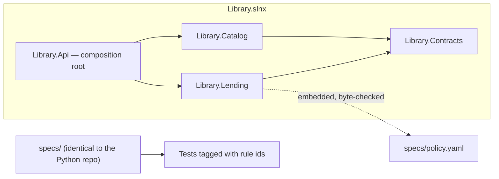

# Spec-driven DDD in .NET — one spec, two implementations

[](https://github.com/hasanozkan/spec-driven-ddd-dotnet/actions/workflows/ci.yml)
 

The library-lending domain from
[spec-driven-ddd-python](https://github.com/hasanozkan/spec-driven-ddd-python)
(Python), implemented again in **C# / ASP.NET Core 10** from **the same
specs** — byte for byte — and serving **the same HTTP contract**.

If specs are the source of truth, a second implementation should need nothing
but the specs. CI holds both halves of that claim:

- **`spec-mirror`** — `specs/` is identical to the Python repository's.
- **`conformance`** — the Python implementation's smoke test runs, unchanged,
  against this API: register a book and a copy, register a member, borrow,
  and see the catalog follow the loan.

## What .NET adds

| | How |
|---|---|
| **Bounded contexts as assemblies** | `Library.Catalog` and `Library.Lending` reference only `Library.Contracts`; a cross-context call does not compile. A test also reads the project files, because an *unused* reference compiles fine ([ADR-0002](docs/adr/0002-the-compiler-as-a-boundary.md)). |
| **Layers as tests** | ArchUnitNET: the domain depends on no framework and no outer layer; application code reaches neither the API nor infrastructure. |
| **Gates as tests** | Traceability (every spec rule has a `[Trait("Rule", id)]` test and vice versa), the embedded policy is byte-identical to `specs/policy.yaml`, and the OpenAPI document matches the committed snapshot. `dotnet test` is the gate. |
| **Time as a dependency** | `TimeProvider` in production, `FakeTimeProvider` in tests — due dates and late fees are tested by moving the clock. |
| **Strict build** | Nullable reference types, analyzers at `latest-recommended`, warnings as errors, `dotnet format --verify-no-changes`. |



## Run it

```sh
make check        # format, strict build, 32 tests (rules, flows, architecture, gates, telemetry)
make run          # http://localhost:8000/openapi/v1.json
make conformance  # in another shell: the Python implementation's smoke test against this API
```

## Operability — the same telemetry contract

Both implementations emit [`specs/telemetry.yaml`](specs/telemetry.yaml).
Here ASP.NET Core's own `http.server.request.duration` covers OPS-R1, a
`LibraryMetrics` subscriber on the event bus counts loans, late fees and
refusals (OPS-R2, R3), and the OpenTelemetry Prometheus exporter serves
`/metrics` outside the API contract (OPS-R4). `OperabilityTests` checks every
metric and attribute in the YAML against a real scrape.

## Tested by breaking it

Each gate was broken once on purpose: a Catalog type using a Lending type,
an unused cross-context project reference, ASP.NET in the domain, a drifted
policy, a rule without a test, an API change without its snapshot, a removed
fee cap. All turned the build red — the second one only after the
project-file test was added, which is why it exists. The first conformance
run also caught a real difference: error responses went out as
`application/json` instead of `application/problem+json`.

## Tour

| Path | |
|---|---|
| [`specs/`](specs) | Rules, language and policy — shared with the Python implementation |
| [`src/Library.Lending/Domain/LendingRules.cs`](src/Library.Lending/Domain/LendingRules.cs) | The rules as pure functions, each naming its spec id |
| [`src/Library.Contracts/`](src/Library.Contracts) | Integration events and the in-process bus — all the contexts share |
| [`src/Library.Api/Program.cs`](src/Library.Api/Program.cs) | Composition root, problem-details mapping |
| [`tests/Library.Tests/`](tests/Library.Tests) | Rules, HTTP flows, architecture, and the gates |
| [`docs/adr/`](docs/adr) | One spec, two implementations · assemblies as boundaries |

---

Part of a set with [spec-driven-ddd-python](https://github.com/hasanozkan/spec-driven-ddd-python),
[llm-tool-calling-assistant](https://github.com/hasanozkan/llm-tool-calling-assistant),
[gitops-reference](https://github.com/hasanozkan/gitops-reference) and
[ai-native-engineering](https://github.com/hasanozkan/ai-native-engineering).
By [Hasan Özkan](https://github.com/hasanozkan) · [LinkedIn](https://www.linkedin.com/in/hasanozkan/)
